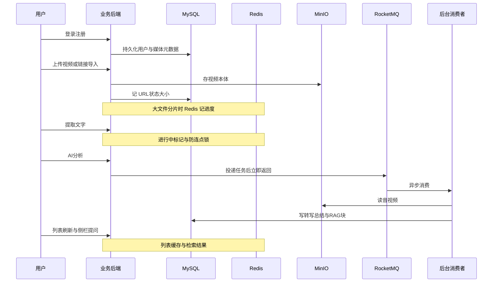

# 中间件深度与面试指南 — 写作计划

## 文档定位

| 文档                                                          | 读者阶段       | 内容侧重                      |
| ----------------------------------------------------------- | ---------- | ------------------------- |
| 已有 `[docs/中间件入门图解教程.md](docs/中间件入门图解教程.md)`                 | 零基础        | 类比、总图、选型表、动手清单            |
| 已有 `[docs/MindVideo-技术栈学习指南.md](docs/MindVideo-技术栈学习指南.md)` | 能看代码       | 类名、接口、简历对照                |
| **新建** `docs/中间件深度与面试指南.md`                                 | 入门后 / 备战面试 | 原理、坑、对比、面试题 + **纯文字业务场景** |

**约束（按你的要求）**：

- 全文**不出现**仓库里的类名、方法名、文件路径、配置键。
- 可用 **MindVideo 业务叙事** 帮助记忆：登录、本地上传/链接导入、>50MB 分片续传、转写、AI 总结、RAG 问答、MD5 去重、连点防护等（与 README / 技术栈指南中的阶段一致，仅作场景描述）。

建议在新建文档开头用 2～3 句话说明与 `[中间件入门图解教程.md](docs/中间件入门图解教程.md)` 的阅读顺序，并指向项目向指南供「对照代码」时使用。

---

## 文档结构（预计 8000～12000 字，分篇清晰）

### 第 0 篇：用一条业务链串起所有中间件（MindVideo 叙事版）

用**一张端到端流程图**（Mermaid）+ 分阶段表格，把用户旅程写成「每个阶段用了哪种中间件、解决什么痛点、若不用会怎样」：

本篇目的：让你面试时能**用 2 分钟讲清「我们这类视频理解平台为什么需要这五件套」**，而不背端口列表。

---

### 第 1 篇：MySQL 深度 + 面试重点

**原理层**

- 关系模型、B+ 树索引直觉（为何 `user_id`、`status` 常建索引）
- 事务 ACID；隔离级别（读未提交 → 可重复读）与「幻读」口语解释
- 慢 SQL 常见原因：无索引、回表、深分页

**结合业务（无代码）**

- `media_files` 一类表：存「谁的上传、MinIO 地址、转写状态、AI 总结」——**权威数据源**
- RAG 场景：`transcript_chunks` 存分块与向量——说明「结构化 + 大字段/向量」仍放 MySQL 的取舍（面试可答：规模上来会考虑专用向量库，当前是简化架构）

**面试题专章（每题：结论 → 原理 → 可挂钩的业务说法）**

- Redis 和 MySQL 分工？缓存与 DB 一致性？
- 为什么大视频不放 MySQL BLOB？
- 乐观锁 vs 悲观锁；状态机更新（转写中 → 完成）如何防并发写乱

---

### 第 2 篇：Redis 深度 + 面试重点

**原理层**

- 单线程模型与为何快；常用五结构及时间复杂度直觉
- 持久化 RDB vs AOF；缓存三大问题：**穿透 / 击穿 / 雪崩**（定义、方案、各自适用场景）
- Cache Aside 读写顺序；**延迟双删**、**Canal 同步** 作为进阶了解（标「加分项」）

**结合业务（文字）**

- 媒体列表缓存：读多写少、TTL、上传/删除后**失效**
- 转写「进行中」标记：短生命周期 key
- 分片上传状态：弱网续传为什么适合 Redis 而不是 MySQL
- 与 Redisson 的分工：Redis 是存储；Redisson 是**分布式锁/限流**的 Java 封装

**面试题专章**

- 缓存和数据库不一致怎么办？
- Redis 挂了会怎样？（降级查库、熔断）
- 分布式锁：SETNX 手写 vs Redisson；**死锁、锁过期、业务未执行完锁没了**；看门狗续期概念
- 令牌桶 vs 漏桶（结合「限制每分钟调 AI 次数」场景口述）

---

### 第 3 篇：MinIO / 对象存储深度 + 面试重点

**原理层**

- Bucket / Object / Key；与文件系统、块存储对比
- S3 兼容 API；**预签名 URL**、直传减轻 API 带宽
- 大文件：**分片上传（Multipart）** 与断点续传概念

**结合业务**

- 视频本体在对象存储；MySQL 只存「目录卡片」
- 转写链路通过 HTTP/内网读流，避免整文件进 JVM 堆
- 链接导入后同样落桶——统一存储模型

**面试题专章**

- 对象存储 vs NAS vs MySQL 存文件？
- 如何保证上传不丢、可续传？
- 访问控制：公有读 vs 私有桶 + 临时 URL

---

### 第 4 篇：RocketMQ 深度 + 面试重点

**原理层**

- NameServer / Broker / Topic / Tag / Consumer Group
- 投递语义：**至少一次**为主；重复消费与**幂等**（业务 id、状态机、去重表）
- 堆积、消费失败、**死信队列**；顺序消息、事务消息（标进阶，知道名词即可）
- **RocketMQ vs Kafka vs RabbitMQ** 一张对比表（场景、吞吐、延迟、生态）

**结合业务**

- 「AI 分析」接口只投递消息、消费者慢慢调模型——对应简历里「长耗时异步化」
- 消息体只带 `mediaId` 等轻量字段，大文件仍在 MinIO
- **MQ vs 线程池 @Async**：持久化、扩容消费者、重启不丢、可监控——与项目指南第 7 节面试答法一致但**扩写原理**

**面试题专章**

- 为什么需要 MQ？
- 如何保证消息不丢？（同步刷盘、ACK、重试）
- 重复消费怎么处理？
- 消息积压怎么排查与扩容？

---

### 第 5 篇：Redisson 与分布式协调（面试合并篇）

- 可重入锁、公平锁、读写锁（知道用途即可）
- `tryLock` 不等待 + 看门狗：防用户连点「转写 / 分析」
- **MD5 内容去重 + 锁**：同一视频多用户上传时，锁的 key 按内容而非用户——面试 storytelling 重点
- 限流保护外部 ASR/LLM 配额

---

### 第 6 篇：Docker / Compose（面试轻量）

- 镜像 vs 容器 vs 卷 vs 网络；`docker compose up` 在本地复现中间件栈的意义
- 面试常问：开发环境与生产差异（K8s、配置中心、健康检查）——点到为止，避免喧宾夺主

---

### 第 7 篇：跨中间件的综合题（高频）

用 MindVideo 场景串联回答模板：

| 综合题               | 文档要给出的答题骨架              |
| ----------------- | ----------------------- |
| 用户连点两次「AI 分析」     | 锁 + 状态机 + 可选 MQ 幂等      |
| 列表看到旧数据           | 缓存失效策略、TTL              |
| 上传成功但分析一直 pending | 查 MQ 堆积、消费者日志、DB 状态     |
| 同一文件上传两次          | MD5 去重、锁粒度、是否复用转写       |
| 系统 QPS 突然 10 倍    | Redis 缓存、MQ 削峰、限流、扩容消费者 |

附：**CAP / 最终一致性** 一句话 + 在本业务里「哪些允许短暂不一致」。

---

### 第 8 篇：模拟面试题库（按组件分类，30+ 题）

格式统一为：

1. **面试官问法**
2. **30 秒版回答**（背这个）
3. **展开版**（原理 3～5 句）
4. **结合视频平台的一句例子**（无代码）

覆盖现有 `[MindVideo-技术栈学习指南.md](docs/MindVideo-技术栈学习指南.md)` 第 7 节已有问题并**显著扩写**（如：索引失效、Redis 热 key、MQ 顺序、MinIO 成本、分布式 ID 等）。

---

### 第 9 篇：学习与自测

- 与入门教程的 4 周路线衔接的「第 5～8 周面试强化」周计划
- 自测清单：能否白板画出第 0 篇时序图、能否口述每类 3 个面试题
- **刻意不展开**：Spring Boot、Vue、RAG 算法细节（仅在 MySQL 篇点到向量存储取舍）；避免文档失控

---

## 实施方式（确认后执行）

1. 新建 `[docs/中间件深度与面试指南.md](docs/中间件深度与面试指南.md)`，按上述 0～9 篇撰写。
2. 在 `[docs/中间件入门图解教程.md](docs/中间件入门图解教程.md)` 文首「配套」一节增加一行链接指向深度版（单行改动，保持双文档互链）。
3. **不修改** `[MindVideo-技术栈学习指南.md](docs/MindVideo-技术栈学习指南.md)` 主体，避免三份文档重复维护；仅在深度版末尾注明「对照代码请看技术栈学习指南」。

---

## 质量标准

- 每个中间件至少：**1 张原理/流程图 + 1 张面试对比或方案表 + 5 道以上带标准答法的面试题**。
- 业务结合一律用「用户上传 B 站链接 → …」叙述，**零代码块引用仓库**。
- 语言：简体中文；Mermaid 遵守 node ID 无空格、特殊字符用引号等规范。

确认本计划后，将按该大纲一次性写完 `中间件深度与面试指南.md` 并完成入门教程的互链补充。