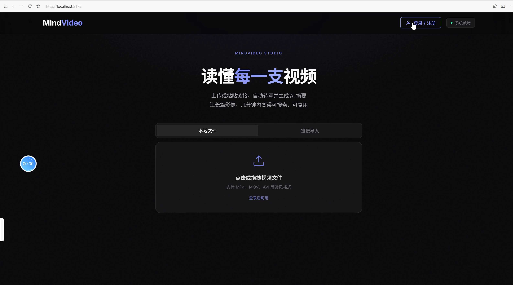
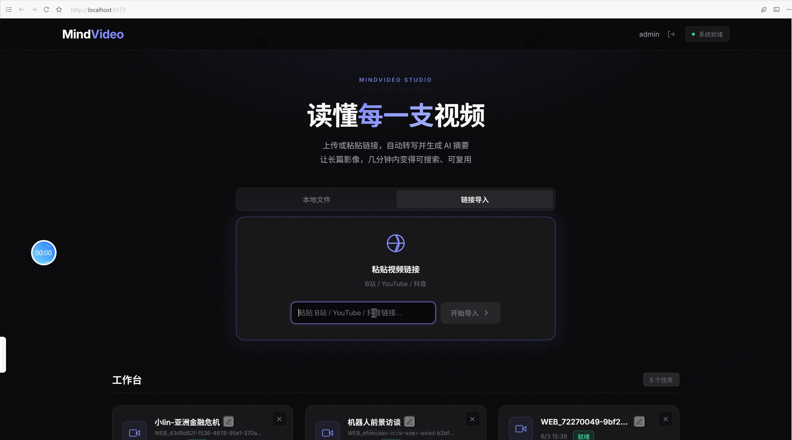
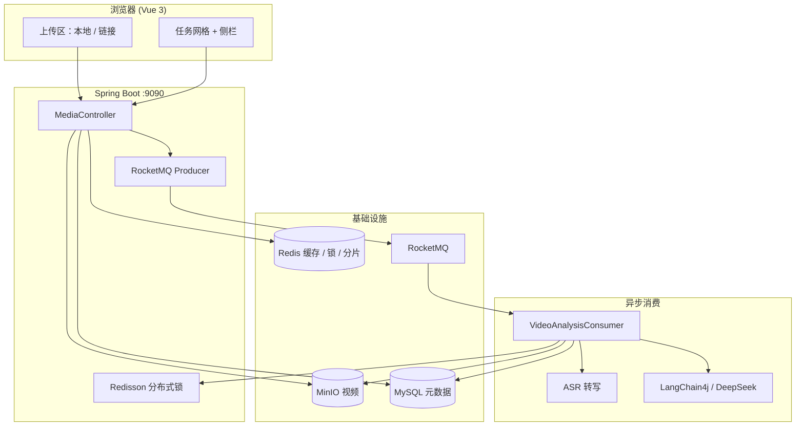

<div align="center">

  
  <br/><br/>

  <h1 align="center">MindVideo-AISum</h1>
  <p align="center"><strong>智能视频内容理解平台</strong></p>

  [](https://git.io/typing-svg)

  <br/><br/>

  <!-- 快捷入口 -->
  <a href="https://github.com/Yongxincc/MindVideo-AISum">
    
  </a>
  <a href="#quick-start">
    
  </a>
  <a href="#demo">
    
  </a>
  <a href="https://github.com/Yongxincc/MindVideo-AISum/blob/main/LICENSE">
    
  </a>

  <br/><br/>

  <!-- 核心亮点 -->
  
  
  
  
  

  <br/><br/>

  ### 🛠 技术栈

  <table align="center" cellpadding="12">
    <tr>
      <td align="center" width="220"><strong>🖥 前端</strong></td>
      <td align="center" width="220"><strong>⚙️ 后端</strong></td>
      <td align="center" width="220"><strong>📦 存储 & 消息</strong></td>
      <td align="center" width="220"><strong>🤖 AI & 媒体</strong></td>
    </tr>
    <tr>
      <td align="center">
        <br/>
        <br/>
        
      </td>
      <td align="center">
        <br/>
        <br/>
        
      </td>
      <td align="center">
        <br/>
        <br/>
        <br/>
        
      </td>
      <td align="center">
        <br/>
        <br/>
        <br/>
        
      </td>
    </tr>
    <tr>
      <td colspan="4" align="center">
        <strong>🐳 部署与工具</strong><br/><br/>
        
        &nbsp;&nbsp;
        
        
      </td>
    </tr>
  </table>

</div>

<br/>
## ✨ 项目预览

<p align="center">
  
</p>

<p align="center">
  <em>上传区支持「本地文件」与「链接导入」，任务卡片可转写、AI 分析、下载音频与自定义命名。</em>
</p>

<br/>

**MindVideo-AISum** 是一个集成用户鉴权、视频上传、音频提取及 AI 自动总结的全链路视频内容理解平台。

针对视频处理场景中常见的 **长耗时阻塞**、**高并发资源冲突** 以及 **大文件传输不稳定** 等痛点，本项目基于 **RocketMQ + Redisson + 分片续传** 重构了系统架构，将「存储与播放」延伸为「理解与复用」。

系统可接入大模型 API、自定义提示词；基于 Function Calling 支持查询信息与精准总结。

<br/>

<a id="demo"></a>

## 🎬 功能演示

### 本地上传（拖拽 / 选择文件）

<p align="center">
  
</p>

<p align="center">
  <video src="docs/assets/demo-local-upload.mp4" controls width="860">
    您的浏览器不支持 HTML5 视频，请<a href="docs/assets/demo-local-upload.mp4">下载演示</a>观看。
  </video>
</p>

支持拖拽或点击选择视频文件，大文件走分片断点续传；上传完成后接口快速返回，转写与 AI 分析在后台异步执行。

---

### 链接导入（粘贴网页 URL）

<p align="center">
  
</p>

<p align="center">
  <video src="docs/assets/demo-url-upload.mp4" controls width="860">
    您的浏览器不支持 HTML5 视频，请<a href="docs/assets/demo-url-upload.mp4">下载演示</a>观看。
  </video>
</p>

粘贴 B 站等平台分享链接，由 **yt-dlp** 拉取视频并写入 MinIO，后续流程与本地上传一致。


## 🏗 系统架构



<br/>

## 💡 核心能力

### 1. 稳定上传体验

- **分片断点续传**：Redis 维护分片状态，弱网与大文件场景更稳。
- **秒级响应**：上传完成后由 RocketMQ 异步处理分析，主线程快速返回。

### 2. 高并发防护

- **分布式锁**：Redisson + MD5 去重，同一热门视频避免重复转码与 AI 调用。
- **令牌桶限流**：保护后端，抑制突发流量。

### 3. 任务处理链路

| 阶段 | 说明 |
|------|------|
| 入口 | 文件直传 MinIO，减轻应用服务器带宽压力 |
| 解耦 | Controller 发 MQ 消息后立即返回 |
| 消费 | 消费者按视频 MD5 加锁，保证同一时刻单线程处理 |
| 重试 | 对第三方 AI API 抖动做指数退避，保证最终一致 |

<br/>

<a id="quick-start"></a>

## 🚀 快速启动

**环境：** Docker、Java 21、Maven、Node.js 18+；视频处理需 FFmpeg，在线链接解析需 yt-dlp。

### 一键启动（推荐）

| 方式 | 说明 |
|------|------|
| 双击 `start-dev.bat` | 启动 Docker 中间件 + 新开两个窗口跑后端 / 前端 |
| 双击 `start-apps.bat` | 仅启动后端 + 前端（中间件已在跑时用） |
| `.\scripts\start-all.ps1` | 同上，PowerShell 里执行 |
| `.\scripts\start-all.ps1 -SkipDocker` | 仅应用，不拉 Docker |

首次使用前请复制并填写 `server/src/main/resources/application.properties`（见下方手动步骤）。

### 只启动中间件

```powershell
# 启动 MySQL / Redis / MinIO / RocketMQ 并自动建表（需先打开 Docker Desktop）
.\scripts\start-dev.ps1
```

### 手动分步

```bash
# 1. 启动中间件（MySQL / Redis / MinIO / RocketMQ）
docker-compose up -d
.\scripts\init-db.ps1

# 2. 配置后端：复制示例文件并填入本地密钥与工具路径
cp server/src/main/resources/application.properties.example server/src/main/resources/application.properties

# 3. 启动后端（端口 9090）
cd server && mvn spring-boot:run

# 4. 启动前端（端口 5173）
cd client && npm install && npm run dev
```

浏览器访问 http://localhost:5173 。`start-dev.ps1` / `init-db.ps1` 会自动创建 `users`、`media_files` 表。

| 服务 | 地址 |
|------|------|
| 前端 | http://localhost:5173 |
| 后端 | http://localhost:9090 |
| MinIO 控制台 | http://localhost:9001 |
| RocketMQ Dashboard | http://localhost:8180 |


## 👥 贡献者

- [Yongxincc](https://github.com/Yongxincc)
