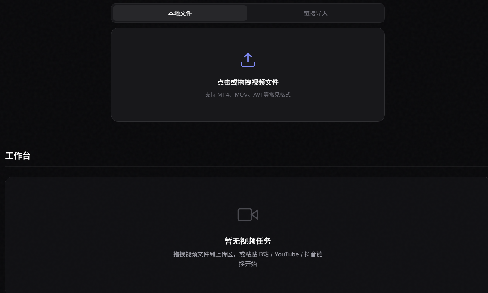
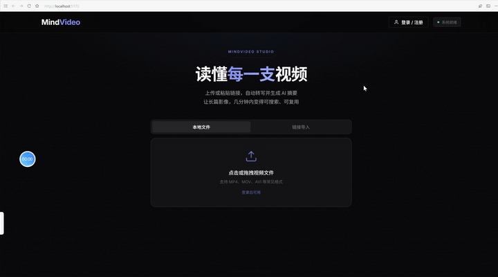
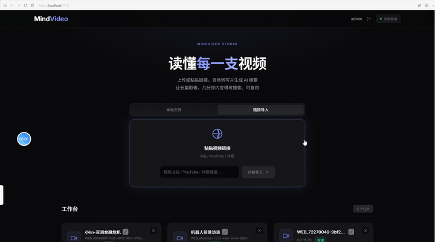
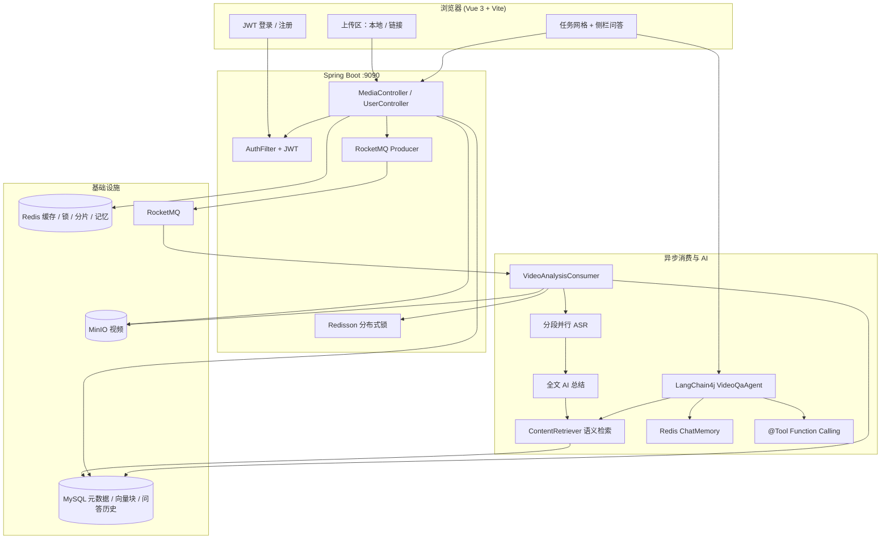

<div align="center">

  
  <br/><br/>

  <h1 align="center">MindVideo-AISum</h1>
  <p align="center"><strong>智能视频内容理解平台</strong></p>

  <br/>

  <a href="https://github.com/Yongxincc/MindVideo-AISum">
    
  </a>
  <a href="#quick-start">
    
  </a>
  <a href="#demo">
    
  </a>
  <a href="https://github.com/Yongxincc/MindVideo-AISum/blob/main/LICENSE">
    
  </a>

</div>

---

## 📑 目录

| | |
| :--- | :--- |
| [✨ 项目预览](#preview) | [🎬 功能演示](#demo) |
| [🏗 系统架构](#architecture) | [💡 核心能力](#features) |
| [🛠 技术栈](#tech-stack) | [🚀 快速启动](#quick-start) |
| [👥 贡献者](#contributors) | |

---

<a id="preview"></a>

## ✨ 项目预览

<p align="center">
  
</p>

<p align="center">
  <em>登录后可上传本地视频或粘贴链接；任务卡片支持转写、AI 分析、下载音频、自定义命名，侧栏展示摘要与 RAG 多轮问答。</em>
</p>

**MindVideo-AISum** 是一个集成 **JWT 用户鉴权**、视频上传、音频提取及 AI 自动总结的全链路视频内容理解平台。

针对视频处理场景中常见的 **长耗时阻塞**、**高并发资源冲突** 以及 **大文件传输不稳定** 等痛点，本项目基于 **RocketMQ + Redisson + 分片续传** 重构了异步处理链路，将「存储与播放」延伸为「理解与复用」。

- **AI 总结**：转写完成后将全文一次直连大模型（DeepSeek-V3 / 硅基流动），按模型上下文上限智能截断。
- **向视频提问**：基于 **LangChain4j** 构建 RAG Agent——语义检索 + Redis 多轮记忆 + `@Tool` 按需调用，侧栏展示回答与引用片段，历史记录持久化至 MySQL。

---

<a id="demo"></a>

## 🎬 功能演示

> **说明：** GitHub 的 README 会过滤 HTML `<video>` 标签，无法在仓库首页内嵌播放 MP4。下方 **GIF 为完整画面录屏**（与 MP4 视频轨一致）；带声音的原始 MP4 请点击下方按钮在 GitHub 文件页播放。

### 本地上传（拖拽 / 选择文件）

<p align="center">
  <a href="https://github.com/Yongxincc/MindVideo-AISum/blob/main/docs/assets/demo-local-upload.mp4">
    
  </a>
</p>

<p align="center">
  <a href="https://github.com/Yongxincc/MindVideo-AISum/blob/main/docs/assets/demo-local-upload.mp4">
    
  </a>
</p>

支持拖拽或点击选择视频文件，大文件走分片断点续传；上传完成后接口快速返回，转写与 AI 分析在后台异步执行。

---

### 链接导入（粘贴网页 URL）

<p align="center">
  <a href="https://github.com/Yongxincc/MindVideo-AISum/blob/main/docs/assets/demo-url-upload.mp4">
    
  </a>
</p>

<p align="center">
  <a href="https://github.com/Yongxincc/MindVideo-AISum/blob/main/docs/assets/demo-url-upload.mp4">
    
  </a>
</p>

粘贴 B 站等平台分享链接，由 **yt-dlp** 拉取视频并写入 MinIO，后续流程与本地上传一致。

---

<a id="architecture"></a>

## 🏗 系统架构



---

<a id="features"></a>

## 💡 核心能力

### 1. 用户鉴权与数据隔离

| 能力 | 说明 |
| :--- | :--- |
| JWT 登录 | `POST /user/register`、`/user/login` 签发 Token，Cookie / Header 携带 |
| 资源隔离 | 所有 `/media/*` 接口经 `AuthFilter` 校验，仅能访问本人任务 |
| 会话持久 | Token 默认 7 天有效，可在 `application.properties` 调整 |

### 2. 稳定上传体验

| 能力 | 说明 |
| :--- | :--- |
| 分片断点续传 | Redis 维护分片状态，弱网与大文件场景更稳 |
| 秒级响应 | 上传 / 合并完成后由 RocketMQ 异步处理，主线程快速返回 |
| 链接导入 | yt-dlp 下载 → MinIO 存储，与用户直传共用后续链路 |

### 3. 高并发防护与去重

| 能力 | 说明 |
| :--- | :--- |
| 分布式锁 | Redisson + `content_md5` 去重，同一热门视频避免重复转码与 AI 调用 |
| 内容复用 | 上传时计算 MD5，可复用已有转写文本与 RAG 向量索引 |
| 任务防重 | 分析 / 转写 / 问答均带 Redis 状态锁，拒绝重复提交 |

### 4. 长音频分段转写

| 能力 | 说明 |
| :--- | :--- |
| FFmpeg 分段 | 长视频按配置时长（默认 10 分钟/段）切分后并行 ASR |
| 并行识别 | 可配置段级并发度（默认 6），遇 429 可调低 |
| 断点续跑 | 段级结果缓存 Redis 7 天，同内容视频可跨任务续跑 |
| 进度可视 | Pipeline 追踪各阶段状态，侧栏展示预计等待时间 |

### 5. LangChain4j RAG 问答

| 能力 | 说明 |
| :--- | :--- |
| 向量索引 | 转写完成后分块 + Embedding（默认 `BAAI/bge-m3`）写入 `transcript_chunks` |
| 语义检索 | `MediaContentRetriever` 从 MySQL 向量库 Top-K 召回相关片段 |
| 多轮对话 | `RedisChatMemoryStore` 按 `mediaId` 隔离上下文，支持连续追问 |
| 工具调用 | Agent 可按需调用 `searchTranscript`、`getAiSummary`、`getVideoMeta` |
| 历史记录 | 问答持久化至 `media_qa_messages`，侧栏可浏览 / 删除 / 清空 |

### 6. 任务处理链路

| 阶段 | 说明 |
| :--- | :--- |
| 入口 | 文件直传 MinIO；>50MB 自动分片断点续传 |
| 去重 | 上传计算 `content_md5`，可复用已有转写与向量索引 |
| 解耦 | Controller 发 MQ 消息后立即返回 |
| 消费 | 消费者按 `content_md5` 加锁，保证同内容单线程处理 |
| 转写 | FFmpeg 提取音频 → 分段并行 ASR（硅基流动） |
| 总结 | 转写全文直连 LLM 生成摘要 |
| 索引 | 总结完成后建立 RAG 向量索引，供问答检索 |
| 重试 | ASR / LLM 调用使用指数退避重试 |

---

<a id="tech-stack"></a>

## 🛠 技术栈

| 层级 | 技术 |
| :--- | :--- |
| 前端 | Vue 3、Vite、Marked + DOMPurify |
| 后端 | Spring Boot 3.5、Undertow、MyBatis-Plus |
| AI / RAG | LangChain4j、硅基流动 DeepSeek-V3、BAAI/bge-m3 |
| 消息 / 缓存 | RocketMQ 4.9、Redis、Redisson |
| 存储 | MySQL 8、MinIO |
| 媒体处理 | FFmpeg、yt-dlp |
| 鉴权 | JWT（HS256） |

---

<a id="quick-start"></a>

## 🚀 快速启动

**环境：** Docker、Java 17+、Maven、Node.js 18+；视频处理需 **FFmpeg**，在线链接解析需 **yt-dlp**。

### 一键启动（推荐）

| 方式 | 说明 |
| :--- | :--- |
| 双击 `start-dev.bat` | 启动 Docker 中间件 + 新开两个窗口跑后端 / 前端 |
| 双击 `start-apps.bat` | 仅启动后端 + 前端（中间件已在跑时用） |
| `.\scripts\start-all.ps1` | 同上，PowerShell 里执行 |
| `.\scripts\start-all.ps1 -SkipDocker` | 仅应用，不拉 Docker |

首次使用前请复制并填写 `server/src/main/resources/application.properties`（见下方手动步骤）。

### 只启动中间件

```powershell
# 启动 MySQL / Redis / MinIO / RocketMQ 并自动建表（需先打开 Docker Desktop）
.\scripts\start-dev.ps1
```

### 手动分步

```bash
# 1. 启动中间件（MySQL / Redis / MinIO / RocketMQ）
docker-compose up -d
.\scripts\init-db.ps1

# 2. 配置后端：复制示例文件并填入本地密钥与工具路径
cp server/src/main/resources/application.properties.example server/src/main/resources/application.properties

# 3. 启动后端（端口 9090）
cd server && mvn spring-boot:run

# 4. 启动前端（端口 5173）
cd client && npm install && npm run dev
```

浏览器访问 http://localhost:5173 ，注册账号后即可使用。

`start-dev.ps1` / `init-db.ps1` 会幂等创建并迁移全部表结构（含 `transcript_chunks`、`media_qa_messages`、`content_md5`、`rag_embed_model` 等字段）。若数据库早已存在且未跑过迁移脚本，执行一次 `.\scripts\init-db.ps1` 即可。

### 关键配置项

在 `application.properties` 中至少需要填写：

| 配置 | 说明 |
| :--- | :--- |
| `auth.jwt.secret` | JWT 签名密钥（生产环境请用足够长的随机字符串） |
| `ai.deepseek.api-key` | 硅基流动 API Key（ASR + LLM + Embedding 共用） |
| `ai.aliyun.api-key` | 阿里云 DashScope Key（若使用阿里云 ASR 策略） |
| `tool.ffmpeg.dir` | FFmpeg 可执行文件目录 |
| `tool.ytdlp.path` | yt-dlp 可执行文件路径 |

更多 RAG / ASR 调优项见 `application.properties.example` 中的注释（Embedding 模型、分块大小、记忆窗口、段级并发等）。

### 服务地址

| 服务 | 地址 |
| :--- | :--- |
| 前端 | http://localhost:5173 |
| 后端 | http://localhost:9090 |
| MinIO 控制台 | http://localhost:9001 （minioadmin / minioadmin） |
| RocketMQ Dashboard | http://localhost:8180 |

---

<a id="contributors"></a>

## 👥 贡献者

- [Yongxincc](https://github.com/Yongxincc)

---

## 写在最后
如果你：

- 觉得有用，想拿来学习或二次开发
- 跑起来遇到问题，愿意提 Issue 反馈
- 或者单纯觉得「这玩意儿有点意思」

**欢迎点个 ⭐ Star**，这是对我继续维护和改进最大的鼓励。

👉 [给 MindVideo-AISum 点个 Star](https://github.com/Yongxincc/MindVideo-AISum)

谢谢你看看到这里 🙏
