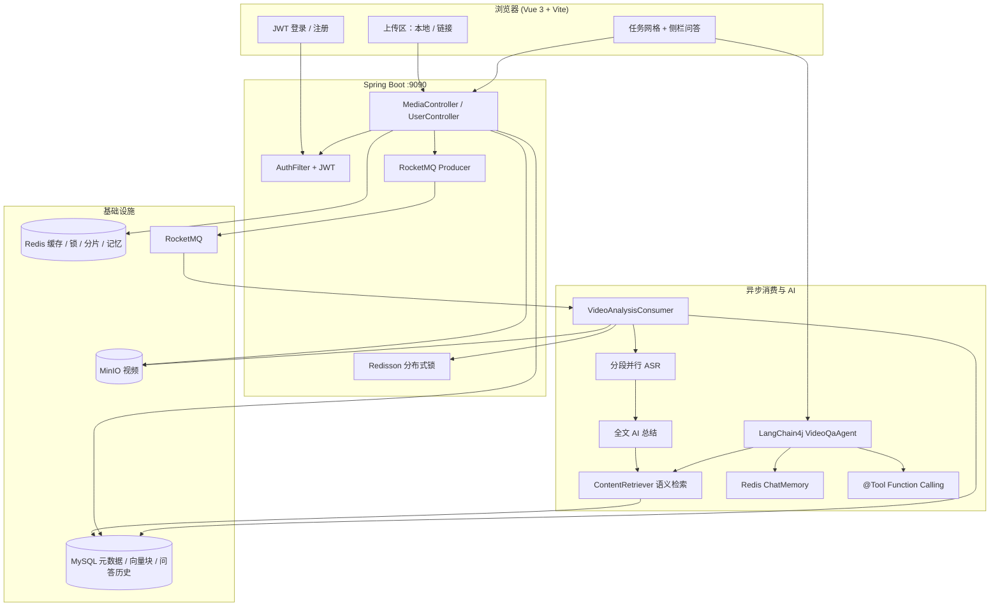

<div align="center">

  
  <br/><br/>

  <h1 align="center">MindVideo-AISum</h1>
  <p align="center"><strong>智能视频内容理解平台</strong></p>

  <br/>

  <a href="https://github.com/Yongxincc/MindVideo-AISum">
    
  </a>
  <a href="#quick-start">
    
  </a>
  <a href="#demo">
    
  </a>
  <a href="https://github.com/Yongxincc/MindVideo-AISum/blob/main/LICENSE">
    
  </a>

</div>

---

## 📑 目录

| | |
| :--- | :--- |
| [✨ 项目预览](#preview) | [🎬 功能演示](#demo) |
| [🏗 系统架构](#architecture) | [💡 核心能力](#features) |
| [🛠 技术栈](#tech-stack) | [🚀 快速启动](#quick-start) |
| [👥 贡献者](#contributors) | |

---

<a id="preview"></a>

## ✨ 项目预览

<p align="center">
  
</p>

<p align="center">
  <em>登录后可上传本地视频或粘贴链接；任务卡片支持转写、AI 分析、下载音频、自定义命名，侧栏展示摘要与 RAG 多轮问答。</em>
</p>

**MindVideo-AISum** 是一个集成 **JWT 用户鉴权**、视频上传、音频提取及 AI 自动总结的全链路视频内容理解平台。

针对视频处理场景中常见的 **长耗时阻塞**、**高并发资源冲突** 以及 **大文件传输不稳定** 等痛点，本项目基于 **RocketMQ + Redisson + 分片续传** 重构了异步处理链路，将「存储与播放」延伸为「理解与复用」。

- **AI 总结**：转写完成后将全文一次直连大模型（DeepSeek-V3 / 硅基流动），按模型上下文上限智能截断。
- **向视频提问**：基于 **LangChain4j** 构建 RAG Agent——语义检索 + Redis 多轮记忆 + `@Tool` 按需调用，侧栏展示回答与引用片段，历史记录持久化至 MySQL。

---

<a id="demo"></a>

## 🎬 功能演示

> **说明：** GitHub 的 README 会过滤 HTML `<video>` 标签，无法在仓库首页内嵌播放 MP4。下方 **GIF 为完整画面录屏**（与 MP4 视频轨一致）；带声音的原始 MP4 请点击下方按钮在 GitHub 文件页播放。

### 本地上传（拖拽 / 选择文件）

<p align="center">
  <a href="https://github.com/Yongxincc/MindVideo-AISum/blob/main/docs/assets/demo-local-upload.mp4">
    
  </a>
</p>

<p align="center">
  <a href="https://github.com/Yongxincc/MindVideo-AISum/blob/main/docs/assets/demo-local-upload.mp4">
    
  </a>
</p>

支持拖拽或点击选择视频文件，大文件走分片断点续传；上传完成后接口快速返回，转写与 AI 分析在后台异步执行。

---

### 链接导入（粘贴网页 URL）

<p align="center">
  <a href="https://github.com/Yongxincc/MindVideo-AISum/blob/main/docs/assets/demo-url-upload.mp4">
    
  </a>
</p>

<p align="center">
  <a href="https://github.com/Yongxincc/MindVideo-AISum/blob/main/docs/assets/demo-url-upload.mp4">
    
  </a>
</p>

粘贴 B 站等平台分享链接，由 **yt-dlp** 拉取视频并写入 MinIO，后续流程与本地上传一致。

---

<a id="architecture"></a>

## 🏗 系统架构



---

<a id="features"></a>

## 💡 核心能力

- **上传与导入**：本地拖拽上传、链接导入（yt-dlp），大文件分片断点续传
- **异步处理**：RocketMQ 解耦，上传后快速返回，转写与分析后台执行
- **语音转写**：FFmpeg 提取音频，长视频分段并行 ASR
- **AI 总结**：转写全文直连大模型生成摘要
- **RAG 问答**：LangChain4j 语义检索 + 多轮对话，侧栏展示回答与引用
- **稳定可靠**：JWT 鉴权、MD5 去重复用、Redisson 分布式锁防并发冲突

---

<a id="tech-stack"></a>

## 🛠 技术栈

Vue 3 · Spring Boot · LangChain4j · RocketMQ · Redis · MySQL · MinIO · FFmpeg · yt-dlp

---

<a id="quick-start"></a>

## 🚀 快速启动

**环境：** Docker、Java 17+、Maven、Node.js 18+、FFmpeg、yt-dlp

```bash
# 1. 启动中间件
docker-compose up -d
.\scripts\init-db.ps1

# 2. 配置后端（复制示例文件并填入 API Key、FFmpeg / yt-dlp 路径等）
cp server/src/main/resources/application.properties.example server/src/main/resources/application.properties

# 3. 启动后端
cd server && mvn spring-boot:run

# 4. 启动前端
cd client && npm install && npm run dev
```

浏览器访问 http://localhost:5173 ，注册账号后即可使用。

---

<a id="contributors"></a>

## 👥 贡献者

- [Yongxincc](https://github.com/Yongxincc)

---

## 写在最后
如果你：

- 觉得有用，想拿来学习或二次开发
- 跑起来遇到问题，愿意提 Issue 反馈
- 或者单纯觉得「这玩意儿有点意思」

**欢迎点个 ⭐ Star**，这是对我继续维护和改进最大的鼓励。

👉 [给 MindVideo-AISum 点个 Star](https://github.com/Yongxincc/MindVideo-AISum)

谢谢你看看到这里 🙏
